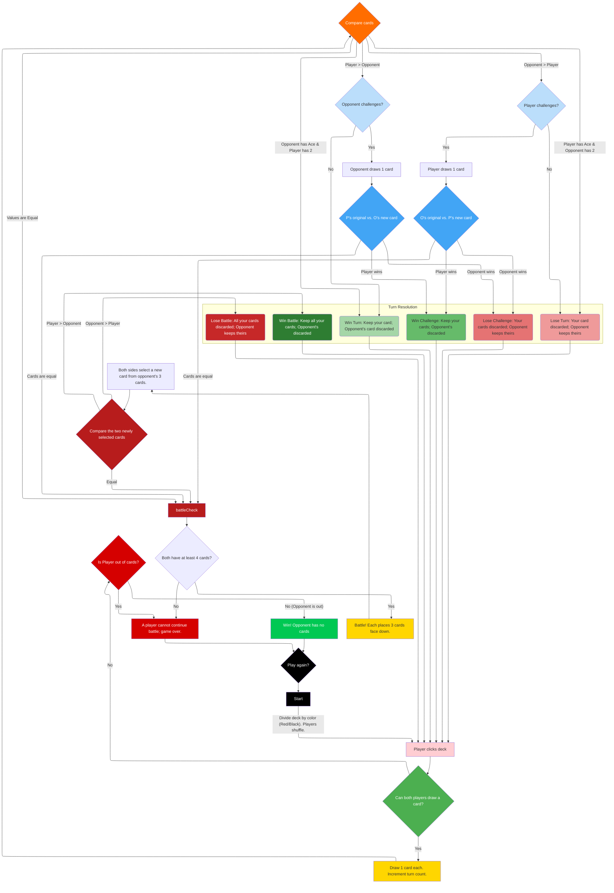

# War of Attrition Game Development Overview

## 📋 Project Documentation Structure

This project follows a structured approach to development planning and documentation:

### Core Documents
1. **`war-of-attrition-requirements.md`** - 📜 **SINGLE SOURCE OF TRUTH**
   - Complete functional and non-functional requirements
   - Game rules and mechanics
   - UI/UX specifications  
   - User stories and EARS requirements
   - **⚠️ NEVER MODIFY THIS FILE**

2. **`development-milestones.md`** - 🏗️ **MILESTONE & ISSUE BREAKDOWN**
   - 7 development milestones with clear goals
   - Detailed issues for each milestone
   - Acceptance criteria for all work items
   - Current development status tracking

3. **`current-development-status.md`** - 📊 **PROJECT STATUS & GUIDANCE**
   - Current development state assessment
   - Immediate priorities and next steps
   - Build and development instructions
   - File structure overview

4. **`implementation-guidelines.md`** - 🛠️ **TECHNICAL IMPLEMENTATION GUIDE**
   - Detailed implementation notes for each milestone
   - Code architecture and structure guidance
   - Technical specifications and examples
   - Testing and performance guidelines

## 🎯 Current State Summary

**Project Phase**: Milestone 5 (Visual Polish & Animations) - 50% Complete

**Completed Work**:
- ✅ **Milestone 1**: Foundation & Setup - Angular 20 PWA, theme toggle, routing, responsive layout
- ✅ **Milestone 2**: Core Game Engine - Complete card/deck models, game state management, card comparison logic, turn resolution engine
- ✅ **Milestone 3**: Basic UI Components - Game board, card component, health bar, action indicators
- ✅ **Milestone 4**: Game Mechanics Implementation - Turn flow, challenge system, battle system, win conditions
- ✅ **Milestone 5 (Partial)**: Material Icons implementation, enhanced theme toggle

**Current Priorities**:
1. 🔄 Card slide and flip animations
2. 🔄 Battle clash visual effects
3. 🔄 Health bar damage animations
4. 🔄 Enhanced visual feedback system

**Next Major Phase**: Milestone 6 (Settings & Customization)
- Advanced settings menu
- Card backing options
- Game statistics
- Export/import functionality

## 🏆 Development Milestones Overview

| Milestone | Goal | Status | Key Deliverables |
|-----------|------|--------|------------------|
| **1. Foundation & Setup** | Solid project foundation | ✅ **COMPLETED** | PWA setup, routing, themes, responsive layout |
| **2. Core Game Engine** | Game logic implementation | ✅ **COMPLETED** | Card models, game state, comparison logic, 60 tests |
| **3. Basic UI Components** | Core visual components | ✅ **COMPLETED** | Game board, cards, health bars, indicators |
| **4. Game Mechanics** | Connect engine to UI | ✅ **COMPLETED** | Turn flow, challenges, battles, win conditions |
| **5. Visual Polish** | Animations and effects | 🔄 **50% Complete** | Material icons, theme toggle, card animations (in progress) |
| **6. Settings & Customization** | Player personalization | ❌ **Not Started** | Settings menu, card backings, discard viewer |
| **7. Testing & Polish** | Quality assurance | ❌ **Not Started** | Performance, accessibility, edge case testing |

## 📚 How to Use This Documentation

### For New Developers
1. Start with `war-of-attrition-requirements.md` to understand the game
2. Review `current-development-status.md` for project overview
3. Check `development-milestones.md` for work breakdown
4. Reference `implementation-guidelines.md` when implementing

### For Project Management
- Use `development-milestones.md` to track progress
- Convert issues to GitHub Issues/Project boards
- Update status in `current-development-status.md` as work completes
- Milestone completion should be clearly marked

### For Development Work
- Always reference requirements document for authoritative specs
- Follow milestone order to ensure proper dependencies
- Use implementation guidelines for technical decisions
- Update documentation as the project evolves

## 🚀 Getting Started

1. **Set up development environment**:
   ```bash
   git clone <repository>
   cd war-of-attrition-game
   npm install
   ```

2. **Review current state**:
   ```bash
   npm start  # Start development server
   npm run build  # Test production build (outputs to /docs)
   npm test -- --watch=false --browsers=ChromeHeadless  # Run 159 tests
   ```

3. **Current development focus** (Milestone 5):
   - Continue Visual Polish & Animations work
   - Implement card slide and flip animations
   - Add battle clash visual effects
   - Create health bar damage animations

4. **Follow best practices**:
   - Use Angular signals for state management
   - Implement standalone components
   - Write tests alongside implementation (159 tests currently passing)
   - Maintain mobile-first responsive design

## 📝 Documentation Maintenance

- **Status updates**: Regularly update `current-development-status.md`
- **Milestone tracking**: Mark completed issues in `development-milestones.md`
- **Implementation notes**: Add learnings to `implementation-guidelines.md`
- **Requirements**: NEVER modify `war-of-attrition-requirements.md`

This documentation structure ensures clear development guidance while maintaining the integrity of the original requirements specification.

## 🎮 Game Flow Diagram

The following Mermaid diagram illustrates the complete game flow logic:

