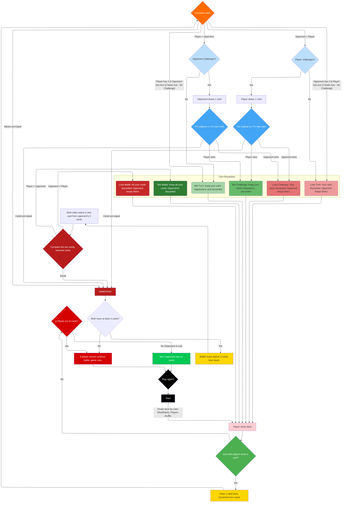
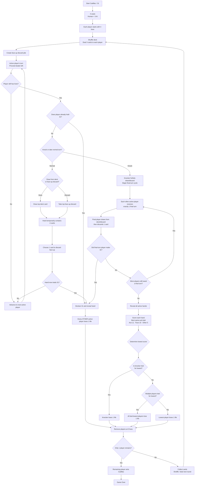

# War of Attrition — Documentation Index & Architecture

## 📋 Documentation Hierarchy

To ensure clarity for developers and automated coding agents, documentation in this repository is structured into three distinct tiers:

```
┌─────────────────────────────────────────────────────────────┐
│ 1. AUTHORITATIVE SPECIFICATION                              │
│    war-of-attrition-requirements.md                         │
│    (Immutable rules, mechanics, and game requirements)      │
└──────────────────────────────┬──────────────────────────────┘
                               │
┌──────────────────────────────▼──────────────────────────────┐
│ 2. CURRENT PROJECT STATUS                                   │
│    current-development-status.md                            │
│    (Live implementation state, priorities, design decisions)│
└──────────────────────────────┬──────────────────────────────┘
                               │
┌──────────────────────────────▼──────────────────────────────┐
│ 3. CREATIVE DIRECTION, CANON & ROADMAP                      │
│    - developer-docs/north-star.md (Creative North Star)     │
│    - developer-docs/narrative-canon.md (Private canon)      │
│    - developer-docs/future-gameplay-ideas.md (Roadmap)      │
│    - development-milestones.md (Historical planning)        │
└─────────────────────────────────────────────────────────────┘
```

### 1. Authoritative Specification
- [`war-of-attrition-requirements.md`](./war-of-attrition-requirements.md) — **SINGLE SOURCE OF TRUTH** for all game rules, rank hierarchies, Battle resolution, and core requirements. **⚠️ NEVER MODIFY THIS FILE.**

### 2. Current Project State & Guidance
- [`current-development-status.md`](./current-development-status.md) — Authoritative live status describing the feature-complete core, two remaining creative sprints, and final release priorities.
- [`implementation-guidelines.md`](./implementation-guidelines.md) — Code quality standards, Angular conventions, signal state rules, and architecture guidelines.

### 3. Creative Direction & Backlog References
- [`developer-docs/north-star.md`](../../developer-docs/north-star.md) — **CREATIVE NORTH STAR** establishing thematic world identity, tone, JRPG-inspired visual grammar, and cosmetic principles.
- [`developer-docs/narrative-canon.md`](../../developer-docs/narrative-canon.md) — **PRIVATE WRITER CANON** for Mont-Rouge, commander dossiers, chapters, unlock philosophy, and source plan.
- [`developer-docs/future-gameplay-ideas.md`](../../developer-docs/future-gameplay-ideas.md) — Remaining Narrative and Clash Visualization sprints, release-polish concerns, and later candidates.
- [`development-milestones.md`](./development-milestones.md) — Historical milestone roadmap used during early development. Completion percentages there do not supersede `current-development-status.md`.

---

## 🎯 Current State Summary

- **Project Phase**: Feature-complete core with two substantial creative sprints remaining: Progressive Narrative Unveiling, then Clash Visualizations / Battlefield Animations. Final release polish follows.
- **Active Table Route**: `src/app/table-game/` (`TableGame`) — Fully responsive across Mobile Phone (`<= 620px`), 7-inch Tablet (`620px - 820px`), and 10-inch Tabletop Grid (`>= 1100px`).
- **Visual Design**: Fixed dark/green felt card table. (Theme toggling was intentionally removed as the visual world is the felt table itself).
- **Automated Tests**: Comprehensive unit test suite (`npm test`) covering game logic, turns, challenges, recursive battles, and UI components.
- **Store Screenshots**: Automated Playwright Chromium screenshot generation suite (`npm run screenshots:store`) with binary header validation (`npm run screenshots:validate`).

---

## 🚀 Development & Build Commands

```bash
# Install dependencies
npm install

# Start local dev server (http://localhost:4200/)
npm start

# Run unit tests (headless)
npm test -- --watch=false --browsers=ChromeHeadless

# Run automated store screenshot generation
npm run screenshots:store

# Validate generated store screenshot artifacts
npm run screenshots:validate

# Production build (outputs to /docs for GitHub Pages)
npm run build
```

---

## 🎮 Game Flow Diagram: War of Attrition


```mermaid
---
config:
  layout: elk
---
flowchart TD
    %% Initialization
    init["Start"] -- "Divide deck by color (Red/Black). Players shuffle." --> startTurn["Player clicks deck"]

    %% Pre-Turn & End-Game Check
    startTurn --> checkDrawCards{"Can both players draw a card?"}
    checkDrawCards -- "No" --> determineWinnerOnDeckOut{"Is Player out of cards?"}
    determineWinnerOnDeckOut -- "Yes" --> loseGame["Lose: No cards to draw"]
    determineWinnerOnDeckOut -- "No (Opponent is out)" --> winGame["Win! Opponent has no cards"]
    checkDrawCards -- "Yes" --> preCompare["Draw 1 card each. Increment turn count."]

    %% Main Turn Loop
    preCompare --> compareCards{"Compare cards"}

    %% Special Ace vs. 2 Rule (Cannot be challenged)
    compareCards -- "Player has 2 & Opponent has Ace (2 beats Ace - No Challenge)" --> resolveNormalWin
    compareCards -- "Opponent has 2 & Player has Ace (2 beats Ace - No Challenge)" --> resolveNormalLoss

    %% Standard Comparison
    compareCards -- "Player > Opponent" --> opponentChallenge{"Opponent challenges?"}
    compareCards -- "Opponent > Player" --> playerChallenge{"Player challenges?"}
    compareCards -- "Values are Equal" --> battleCheck

    %% Challenge Sub-flow
    opponentChallenge -- "No" --> resolveNormalWin
    opponentChallenge -- "Yes" --> drawOpponentChallenge["Opponent draws 1 card"]
    drawOpponentChallenge --> compareOpponentChallenge{"P's original vs. O's new card"}
    compareOpponentChallenge -- "Opponent wins" --> resolveChallengeLoss
    compareOpponentChallenge -- "Player wins" --> resolveChallengeWin
    compareOpponentChallenge -- "Cards are equal" --> battleCheck

    playerChallenge -- "No" --> resolveNormalLoss
    playerChallenge -- "Yes" --> drawPlayerChallenge["Player draws 1 card"]
    drawPlayerChallenge --> comparePlayerChallenge{"O's original vs. P's new card"}
    comparePlayerChallenge -- "Player wins" --> resolveChallengeWin
    comparePlayerChallenge -- "Opponent wins" --> resolveChallengeLoss
    comparePlayerChallenge -- "Cards are equal" --> battleCheck

    %% Battle Sub-flow
    battleCheck --> checkCardsForBattle{"Both have at least 4 cards?"}
    checkCardsForBattle -- "No" --> loseGame["A player cannot continue battle; game over."]
    checkCardsForBattle -- "Yes" --> setupBattle["Battle! Each places 3 cards face down."]
    setupBattle --> selectBattleCards["Both sides select a new card from opponent's 3 cards."]
    selectBattleCards --> compareBattleCards{"Compare the two newly selected cards"}
    compareBattleCards -- "Player > Opponent" --> resolveBattleWin
    compareBattleCards -- "Opponent > Player" --> resolveBattleLoss
    compareBattleCards -- "Equal" --> battleCheck

    %% Resolution Nodes
    subgraph Turn Resolution
        direction LR
        resolveNormalWin("Win Turn: Keep your card; Opponent's card discarded")
        resolveNormalLoss("Lose Turn: Your card discarded; Opponent keeps theirs")
        resolveChallengeWin("Win Challenge: Keep your cards; Opponent's discarded")
        resolveChallengeLoss("Lose Challenge: Your cards discarded; Opponent keeps theirs")
        resolveBattleWin("Win Battle: Keep all your cards; Opponent's discarded")
        resolveBattleLoss("Lose Battle: All your cards discarded; Opponent keeps theirs")
    end

    %% Link Resolutions to Next Turn
    resolveNormalWin & resolveNormalLoss --> startTurn
    resolveChallengeWin & resolveChallengeLoss --> startTurn
    resolveBattleWin & resolveBattleLoss --> startTurn

    %% End Game
    winGame --> playAgain{"Play again?"}
    loseGame --> playAgain
    playAgain --> init

    %% Styling
    style init fill:#000000,color:#FFFFFF
    style playAgain fill:#000000,color:#FFFFFF
    style startTurn fill:#FFCDD2
    style checkDrawCards fill:#4CAF50,color:#FFFFFF
    style determineWinnerOnDeckOut fill:#D50000,color:#FFFFFF
    style preCompare fill:#FFD600
    style compareCards fill:#FF6D00,color:#FFFFFF
    style battleCheck fill:#B71C1C,color:#FFFFFF
    style setupBattle fill:#FFD600
    style compareBattleCards fill:#B71C1C,color:#FFFFFF
    style loseGame fill:#D50000,color:#FFFFFF
    style opponentChallenge fill:#BBDEFB
    style playerChallenge fill:#BBDEFB
    style comparePlayerChallenge fill:#42A5F5,color:#FFFFFF
    style compareOpponentChallenge fill:#42A5F5,color:#FFFFFF
    style winGame fill:#00C853,color:#FFFFFF
    style resolveNormalWin fill:#A5D6A7
    style resolveNormalLoss fill:#EF9A9A
    style resolveChallengeWin fill:#66BB6A
    style resolveChallengeLoss fill:#E57373
    style resolveBattleWin fill:#2E7D32,color:#FFFFFF
    style resolveBattleLoss fill:#C62828,color:#FFFFFF
```

---

## 🎮 Secondary Game: Cadillac / 31 (Concept)


```mermaid
flowchart TD
    START["Start Cadillac / 31"] --> SETUP["4 seats<br/>Human + 3 AI"]
    SETUP --> LIVES["Each player starts with 4 lives"]
    LIVES --> DEAL["Shuffle deck<br/>Deal 3 cards to each player"]
    DEAL --> DISCARD_START["Create face-up discard pile"]
    DISCARD_START --> TURN["Active player's turn<br/>Proceed dealer-left"]

    TURN --> ALIVE{"Player still has lives?"}
    ALIVE -- No --> NEXT
    ALIVE -- Yes --> HAS31{"Does player already hold 31?"}

    HAS31 -- Yes --> DECLARE31["Declare 31 and reveal hand"]
    DECLARE31 --> ALL_LOSE["Every OTHER active player loses 1 life"]
    ALL_LOSE --> ELIMINATE

    HAS31 -- No --> KNOCK_OR_PLAY{"Knock or take normal turn?"}

    KNOCK_OR_PLAY -- Knock --> KNOCK["Knocker forfeits draw/discard<br/>Begin final-turn cycle"]
    KNOCK --> FINAL_NEXT["Each other active player receives<br/>exactly 1 final turn"]

    KNOCK_OR_PLAY -- Normal --> DRAW_CHOICE{"Draw from deck<br/>or face-up discard?"}
    DRAW_CHOICE -- Deck --> DRAW_DECK["Draw top deck card"]
    DRAW_CHOICE -- Discard --> DRAW_DISCARD["Take top face-up discard"]

    DRAW_DECK --> FOUR["Hand temporarily contains 4 cards"]
    DRAW_DISCARD --> FOUR
    FOUR --> DISCARD["Choose 1 card to discard face-up"]
    DISCARD --> AFTER_DRAW_31{"Hand now totals 31?"}

    AFTER_DRAW_31 -- Yes --> DECLARE31
    AFTER_DRAW_31 -- No --> NEXT["Advance to next active player"]
    NEXT --> TURN

    FINAL_NEXT --> FINAL_TURN["Final player draws from deck/discard<br/>then discards 1 card"]
    FINAL_TURN --> FINAL31{"Did final-turn player make 31?"}
    FINAL31 -- Yes --> DECLARE31
    FINAL31 -- No --> MORE_FINAL{"More players still owed<br/>a final turn?"}
    MORE_FINAL -- Yes --> FINAL_NEXT
    MORE_FINAL -- No --> REVEAL["Reveal all active hands"]

    REVEAL --> SCORE["Score each hand<br/>Best same-suit total<br/>Ace 11 · Face 10 · Other 5"]
    SCORE --> LOWEST{"Determine lowest score"}

    LOWEST --> KNOCKER_TIE{"Is knocker tied<br/>for lowest?"}
    KNOCKER_TIE -- Yes --> KNOCKER_LOSS["Knocker loses 1 life"]
    KNOCKER_TIE -- No --> LOW_TIE{"Multiple players tied<br/>for lowest?"}

    LOW_TIE -- Yes --> TIED_LOSE["All tied-lowest players lose 1 life"]
    LOW_TIE -- No --> LOW_LOSES["Lowest player loses 1 life"]

    KNOCKER_LOSS --> ELIMINATE["Remove players at 0 lives"]
    TIED_LOSE --> ELIMINATE
    LOW_LOSES --> ELIMINATE

    ELIMINATE --> WINNER{"Only 1 player remains?"}
    WINNER -- Yes --> GAME_WIN["Remaining player wins Cadillac"]
    WINNER -- No --> NEW_ROUND["Collect cards<br/>Shuffle / deal next round"]
    NEW_ROUND --> DEAL

    GAME_WIN --> END["Game Over"]
```
